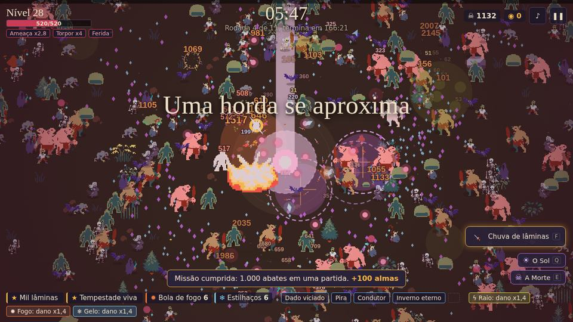
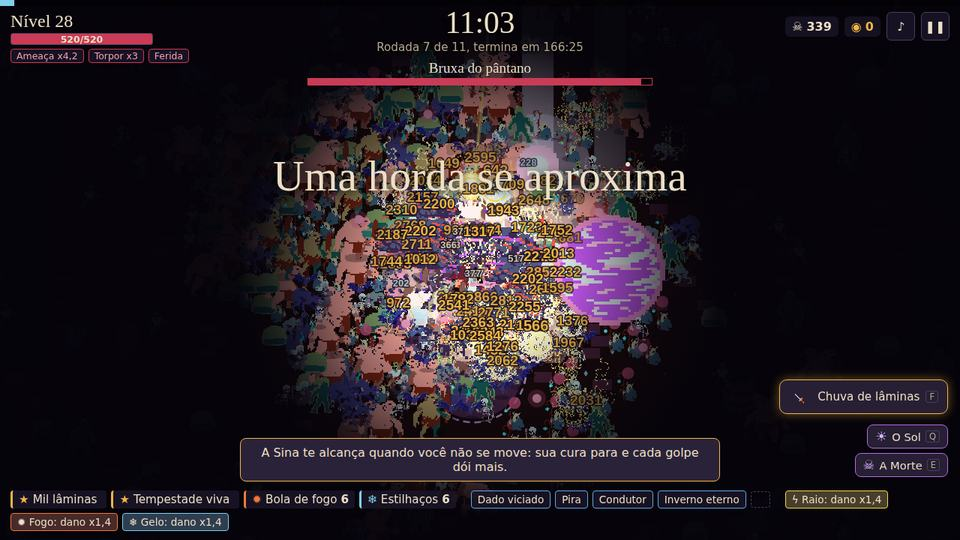
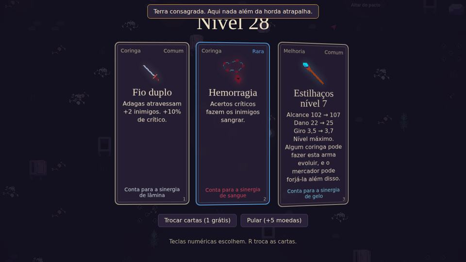

# Sina

**Roguelite de navegador: sobreviva à horda, monte combos com cartas e derrote o Ceifador.**
Mistura a sobrevivência contra hordas de *Vampire Survivors* com a construção de combos de *Balatro*, com runs procedurais.



🎮 **[Jogar no navegador](https://japax01.com.br/sina/)** · gratuito, instala como app

| | | |
|---|---|---|
|  |  |  |

## Destaques

- **Horda com variedade de inimigos** (enxames, atiradores, bombas, divisores, investidas) e **chefes** com padrões próprios de ataque
- **Cartas e relíquias** que se combinam em combos diferentes a cada run
- **Almas** como moeda entre as runs e **desafio diário**
- **Conta opcional** (Firebase Auth) com progresso salvo na nuvem
- **6 idiomas**: português, inglês, espanhol, japonês, coreano e russo
- **Monetização preparada**: anúncios recompensados (AdSense for Games / SDK da CrazyGames) e compras pelo Mercado Pago, com restauração de compra
- **PWA**: instala no celular e no computador e funciona offline
- Publicado também na **CrazyGames**

## Tecnologias

HTML5 Canvas · JavaScript puro (sem engine e sem build) · Firebase Auth · Service Worker/PWA · Mercado Pago (Checkout Pro, via funções serverless da Vercel) · SDK da CrazyGames

## Estrutura

```
index.html          o jogo inteiro (render em Canvas, lógica, interface e textos)
lancamento.html     página de lançamento
privacidade.html    política de privacidade
sw.js, manifest.json  app instalável e offline
tela-*.jpg          capturas de tela por idioma (lojas e divulgação)
```

As funções de pagamento (`api/sina-pagamento.js` e `api/sina-confirmar.js`) ficam no repositório do site, [Principal](https://github.com/Japinha01/Principal), junto com a configuração de compras e anúncios.

## Rodar localmente

```bash
python -m http.server 8000
# abra http://localhost:8000/
```
